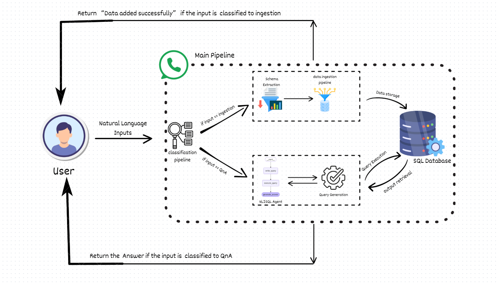

# Agatha - NL2SQL based whatsapp expense tracker

This project is an AI-powered WhatsApp Expense Bot designed to process natural language input, classify it as either an "ingestion" or "QnA" type, and respond accordingly. The bot uses an agentic AI pipeline, where it performs Natural Language to SQL (NL2SQL) or Text to SQL (TXT2SQL) operations to manage and query transactions stored in an SQLite database. It can handle transactions by extracting relevant details (like amount, date, and vendor) and store them, or it can answer user queries based on the stored data.

## Workflow



The bot follows a 3-step process to handle natural language inputs:

### Step 1: Natural Language Input Classification
- The user sends a natural language input (e.g., via WhatsApp or a POST request).
- The input is classified into two categories:
  1. **Ingestion**: The input contains transaction details and needs to be stored in the database.
  2. **QnA**: The input is a query about the stored transaction data and requires an SQL query for processing.

### Step 2: Ingestion Process
- If the input is classified as **ingestion**, the bot extracts relevant transaction details (e.g., date, amount, vendor, and description).
- The extracted data is then ingested into the SQLite database for future reference.

### Step 3: QnA Process
- If the input is classified as **QnA**, the bot formulates an SQL query based on the question and queries the database for relevant information.
- The response is generated based on the SQL query results and sent back to the user.

## Setup

### Prerequisites
1. Python 3.10+
2. Required Python packages listed in `requirements.txt` (details below).
3. A Twilio account with WhatsApp messaging enabled (for WhatsApp bot functionality).

### Installation

1. Clone the repository:
   ```bash
   git clone https://github.com/devroopsaha744/agatha.git
   cd  agatha
   ```

2. Install dependencies:
   ```bash
   pip install -r requirements.txt
   ```

3. Create a `.env` file in the root directory and add your Groq API key and Twilio credentials:
   ```
   GROQ_API_KEY=<your_groq_api_key>
   TWILIO_ACCOUNT_SID=<your_account_sid>
   TWILIO_AUTH_TOKEN=<your_auth_token>
   TWILIO_PHONE_NUMBER=<your_twilio_phone_number>
   ```

4. Ensure SQLite is set up for the project (it will be created automatically if it doesn't exist).

### Starting the Application

To run the application locally, use the following command:

```bash
uvicorn main:app --reload
```

This will start the FastAPI server locally. The application will listen for incoming HTTP requests on port `8000` by default.

---

## API Endpoints

### 1. `/process` (POST)

**Description**: Processes natural language input and classifies it as either "ingestion" or "chat". Depending on the classification, it either ingests the data into the database or processes it through the QnA pipeline.

**Request Body** (JSON):
```json
{
  "text": "I spent 500 at McDonald's yesterday"
}
```

**Response** (JSON):
```json
{
  "status": "success",
  "type": "ingestion",
  "message": "Data added successfully."
}
```

**Example Input for Ingestion**:
- "I spent 500 at McDonald's yesterday"
- "Paid 2000 for rent on 2024-02-01"
- "Added a transaction of 1500 for groceries on Feb 10"

**Example Input for QnA**:
- "What was my highest expense last month?"
- "Show all transactions for February"
- "How much did I spend on Amazon?"

---

### 2. `/whatsapp` (POST)

**Description**: This endpoint is used for receiving WhatsApp messages via Twilio, processing them using the ingestion or QnA pipeline, and responding with a TwiML response.

**Request Body** (Form Data):
- `Body`: The text message received from WhatsApp.
- `From`: The sender's WhatsApp number.

**Response** (XML, Twilio-compatible):
```xml
<?xml version="1.0" encoding="UTF-8" ?>
<Response>
    <Message>Your response here</Message>
</Response>
```

---

## Example Usage

### Example 1: Ingestion
**User Input**: "I spent 500 at McDonald's yesterday"

**Bot Response**:
```json
{
  "status": "success",
  "type": "ingestion",
  "message": "Data added successfully."
}
```
- The bot extracts the transaction details: Date, Amount, Vendor, and Description, and stores it in the SQLite database.

### Example 2: QnA
**User Input**: "What was my highest expense last month?"

**Bot Response**:
```json
{
  "status": "success",
  "type": "qna",
  "answer": "Your highest expense last month was 1500 for groceries."
}
```
- The bot queries the database and returns the highest expense for the last month.

---

## File Structure

```
.
├── .env                     # Environment variables for API keys
├── requirements.txt          # Required Python packages
├── main.py                   # FastAPI application code
└── transactions.db           # SQLite database for storing transactions
```

---

## Conclusion

This bot is powered by **Agentic AI**, capable of understanding natural language input for both transaction ingestion and querying. It integrates with WhatsApp using Twilio to allow users to interact with their expense data via text messages. The bot leverages powerful language models for **NL2SQL** and **TXT2SQL** operations to provide accurate answers to user queries and store transaction details efficiently.

